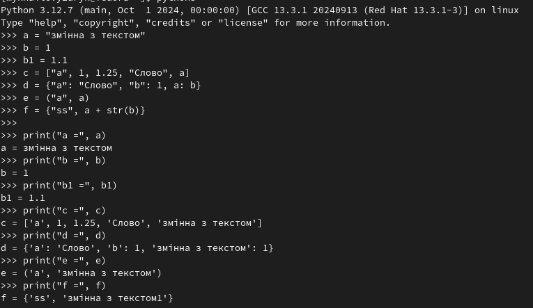
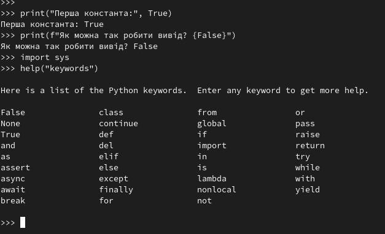
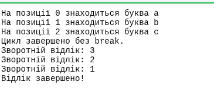
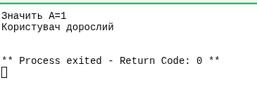
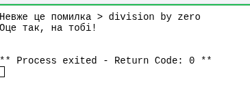
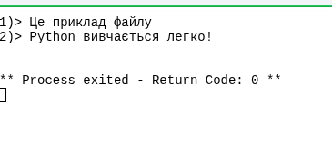
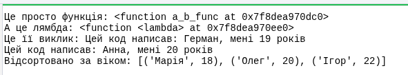

# Звіт до роботи

## Тема: _Основи програмування на Python_

### Мета роботи: _Навчитись застосовувати основні конструкції мови Python, виконати приклади та створити власні приклади коду_

---

### Виконання роботи

- Результати виконання завдання _1...N_;

1. **Познайомились з основними типами даних у Python**  
     
    a = "змінна з текстом"  
    b = 1  
    b1 = 1.1  
    c = ["a", 1, 1.25, "Слово", a]  
    d = {"a": "Слово", "b": 1, a: b}  
    e = ("a", a)  
    f = {"ss", a + str(b)}

  
 << Результат виконання >>  
 a = змінна з текстом  
 b = 1  
 b1 = 1.1  
 c = ['a', 1, 1.25, 'Слово', 'змінна з текстом']  
 d = {'a': 'Слово', 'b': 1, 'змінна з текстом': 1}  
 e = ('a', 'змінна з текстом')  
 f = {'змінна з текстом1', 'ss'}

---

2. **Вивели вбудовані константи та зарезервовані слова Python**  
     
    print("Перша константа:", True)  
    print(f"Як можна так робити вивід? {False}")  
    import sys  
    help("keywords")

  
 << Результат виконання >>  
 Перша константа: True  
 Як можна так робити вивід? False  
 (Далі виводиться список зарезервованих слів Python: if, else, for, while, def, return, import, lambda, class, тощо)

---

3. **Ознайомились з вбудованими функціями**  
     
    print("abs(-12.5) =", abs(-12.5))  
    print(f"abs(-12.5) == abs(12.5): {abs(-12.5) == abs(12.5)}")  
    print("round(3.14159, 2) =", round(3.14159, 2))  
    print("len(c) =", len(c))

  
 << Результат виконання >>  
 abs(-12.5) = 12.5  
 abs(-12.5) == abs(12.5): True  
 round(3.14159, 2) = 3.14  
 len(c) = 5

---

4.  **Попрацювали з циклами `for` та `while`**  
      
     letters = ["a", "b", "c"]  
     for i in range(len(letters)):  
     print(f"На позиції {i} знаходиться буква {letters[i]}")  
     else:  
     print("Цикл завершено без break.")

        count = 3
        while count > 0:
            print(f"Зворотній відлік: {count}")
            count -= 1
        else:
            print("Відлік завершено!")

  
 << Результат виконання >>  
 На позиції 0 знаходиться буква a  
 На позиції 1 знаходиться буква b  
 На позиції 2 знаходиться буква c  
 Цикл завершено без break.  
 Зворотній відлік: 3  
 Зворотній відлік: 2  
 Зворотній відлік: 1  
 Відлік завершено!

---

5.  **Розгалуження (`if`, `elif`, `else`)**  
      
     from random import randint  
     A = randint(0, 1)  
     print(f"Значить A={A}" if A else f"Але може бути, що A={A}")

        age = randint(10, 30)
        if age < 18:
            print("Користувач неповнолітній")
        elif age == 18:
            print("Користувачу саме 18!")
        else:
            print("Користувач дорослий")

  
 << Приклад результату >>  
 Значить A=1  
 Користувач дорослий

---

6. **Використали конструкцію try-except-finally**  
     
    A = 0  
    try:  
    print("Що буде якщо", 10 / A, "?")  
    except Exception as e:  
    print("Невже це помилка >", e)  
    finally:  
    print("Оце так, на тобі!")

  
 << Результат >>  
 Невже це помилка > division by zero  
 Оце так, на тобі!

---

7.  **Використали контекст-менеджер `with`**  
      
     with open("example.txt", "w", encoding="utf-8") as f:  
     f.write("Це приклад файлу\nPython вивчається легко!\n")

        with open("example.txt", "r", encoding="utf-8") as f:
            for num, line in enumerate(f, start=1):
                print(f"{num})> {line.strip()}")

  
 << Результат >>  
 1)> Це приклад файлу  
 2)> Python вивчається легко!

---

8.  **Ознайомились з лямбда-функціями**  
      
     def a_b_func(a, b):  
     return a, b

        this_is_lambda = lambda first, age: f"Цей код написав: {first}, мені {age} років"
        print("Це просто функція:", a_b_func)
        print("А це лямбда:", this_is_lambda)
        print("Це її виклик:", this_is_lambda("Герман", 19))
        print(this_is_lambda(*a_b_func("Анна", 20)))

        students = [("Олег", 20), ("Марія", 18), ("Ігор", 22)]
        students_sorted = sorted(students, key=lambda x: x[1])
        print("Відсортовано за віком:", students_sorted)

  
 << Результат >>  
 Це просто функція: <function a_b_func at 0x000002...>  
 А це лямбда: <function <lambda> at 0x000002...>  
 Це її виклик: Цей код написав: Герман, мені 19 років  
 Цей код написав: Анна, мені 20 років  
 Відсортовано за віком: [('Марія', 18), ('Олег', 20), ('Ігор', 22)]

---

Промпт до AI

    Я вивчаю Python у Jupyter Notebook. Поясни, будь ласка, основи Python для початківця — що таке змінні, типи даних, оператори, цикли, функції та приклади для кожного з них. Дай зрозумілі пояснення та код, який я зможу виконати в Jupyter Notebook.

Відповідь AI

    Python — це інтерпретована мова програмування високого рівня, відома своєю простотою та читабельністю.
    Основні поняття включають: змінні, типи даних, оператори, умови, цикли, функції, обробку помилок та роботу з файлами.

---

### Висновок:

- ❓ **Що зроблено в роботі:**
- Виконано базові приклади на Python: робота зі змінними, циклами, умовами, обробкою помилок, контекст-менеджерами та лямбдами.

- ❓ **Чи досягнуто мети роботи:**
- Так, мету досягнуто — засвоєно основи синтаксису Python.

- ❓ **Які нові знання отримано:**
- Навчився використовувати основні структури мови, працювати з файлами та функціями.

- ❓ **Чи вдалося виконати всі завдання:**
- Так, усі завдання виконано, приклади перевірено.

- ❓ **Чи виникли складності:**
- ні

- ❓ **Чи подобається такий формат здачі:**
- Так, Markdown-звіт — зручний, структурований і зрозумілий формат.
