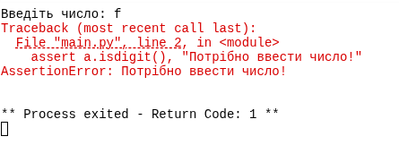
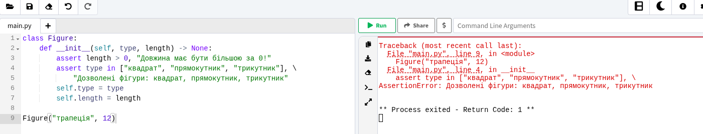
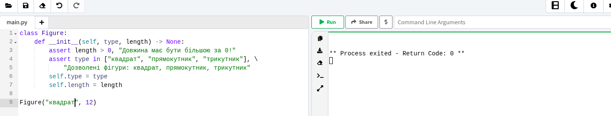
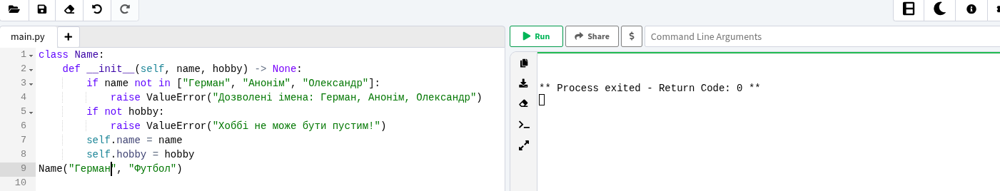
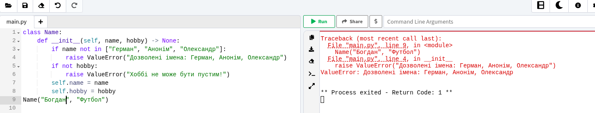
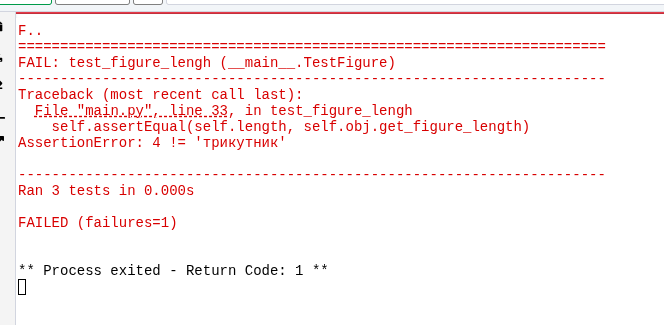
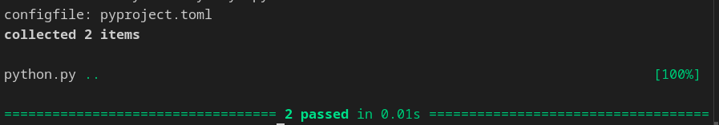
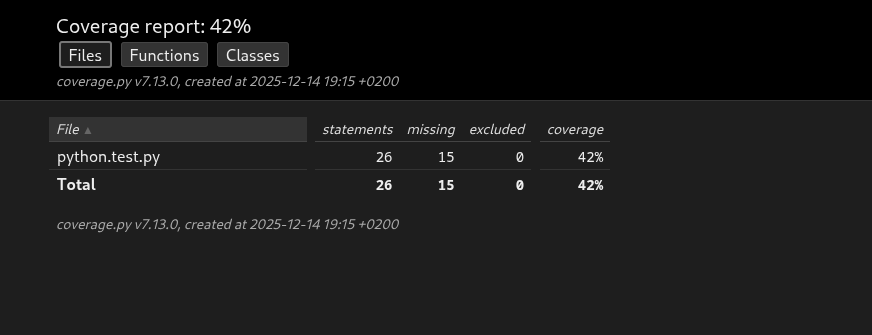

# Звіт до роботи

## Тема: _Основи програмування на Python_

### Мета роботи: _Навчитись застосовувати основні конструкції мови Python, виконати приклади та створити власні приклади коду_

---

### Виконання роботи

1.  a = input("Введіть число: ")
    assert a.isdigit(), "Потрібно ввести число!"
    print(f"Введене число: {a}")

---

2.  class Figure:
    def **init**(self, type, length) -> None:
    assert length > 0, "Довжина має бути більшою за 0!"
    assert type in ["квадрат", "прямокутник", "трикутник"], \
     "Дозволені фігури: квадрат, прямокутник, трикутник"
    self.type = type
    self.length = length

---

3.  class Name:
    def **init**(self, name, hobby) -> None:
    if name not in ["Богдан", "Анонім", "Олександр"]:
    raise ValueError("Дозволені імена: Богдан, Анонім, Олександр")
    if not hobby:
    raise ValueError("Хоббі не може бути пустим!")
    self.name = name
    self.hobby = hobby

---

4.  Юніт тести

    import unittest
    from random import choice, randint

    class Figure:
    FIGURES = ["квадрат", "прямокутник", "трикутник"]

        def __init__(self, type, length) -> None:
            assert length > 0
            assert type in self.FIGURES
            self.type = type
            self.length = length

        @property
        def get_figure_type(self):
            return self.type

        @property
        def get_figure_length(self):
            return self.type  # ❌ помилка

    class TestFigure(unittest.TestCase):

        def setUp(self):
            self.figure = choice(Figure.FIGURES)
            self.length = randint(1, 10)
            self.obj = Figure(self.figure, self.length)

        def test_figure_type(self):
            self.assertEqual(self.figure, self.obj.get_figure_type)

        def test_figure_lengh(self):
            self.assertEqual(self.length, self.obj.get_figure_length)

        def test_obj(self):
            with self.assertRaises(AssertionError):
                Figure("коло", 1)
        if __name__ == '__main__':
            unittest.main()

test_figure_type ✅ Passed
test_figure_lengh ❌ Failed (повертається type, а не length)
test_obj ✅ Passed

---

5.  **Pytest**

        class Figure:
            FIGURES = ["квадрат", "прямокутник", "трикутник"]

            def __init__(self, type, length) -> None:
                assert length > 0
                assert type in self.FIGURES
                self.type = type
                self.length = length

            @property
            def get_figure_type(self):
                return self.type

            @property
            def get_figure_length(self):
                return self.type  # ❌ помилка
            @property
            def get_angles(self):
                if self.type in ["квадрат", "прямокутник"]:
                    return 4
                if self.type == "трикутник":
                    return 3

        def test_app_triangle():
            fig = "трикутник"
            triangle = Figure(fig, 4)
            assert triangle.type == fig

        def test_get_angles():
            triangle = Figure("трикутник", 1)
            assert triangle.get_angles == 3

### Висновок:

- ❓ **Що зроблено в роботі:**  
  У ході лабораторної роботи було досліджено основні підходи до тестування програмного забезпечення мовою Python. Реалізовано перевірки правильності роботи коду за допомогою `assert`, виконано валідацію вхідних даних у процедурному та об’єктно-орієнтованому стилі. Створено класи з перевіркою коректності аргументів, обробкою помилок через `AssertionError` та `ValueError`. Розроблено та виконано юніт тести з використанням бібліотек `unittest` та `pytest`, виявлено та виправлено помилки у коді. Додатково налаштовано збір статистики покриття коду тестами за допомогою бібліотеки `coverage` та згенеровано HTML-звіт покриття.

- ❓ **Чи досягнуто мети роботи:**  
  Так, мету лабораторної роботи досягнуто. Отримано практичні навички написання тестів, запуску автоматизованого тестування, аналізу результатів виконання тестів та оцінки покриття коду. Усі поставлені завдання виконано відповідно до методичних вказівок.

- ❓ **Які нові знання отримано:**  
  У процесі виконання роботи отримано знання щодо використання оператора `assert` для перевірки умов, створення власних перевірок у класах, застосування виключень для валідації даних, написання юніт тестів з використанням `unittest` та `pytest`, запуску тестів з консолі та середовища розробки, а також аналізу покриття коду тестами з використанням бібліотеки `coverage` та інструментів візуалізації результатів.

- ❓ **Чи вдалося виконати всі завдання:**
Так, усі завдання виконано, приклади перевірено.

- ❓ **Чи виникли складності:**
- ні

- ❓ **Чи подобається такий формат здачі:**
  так
